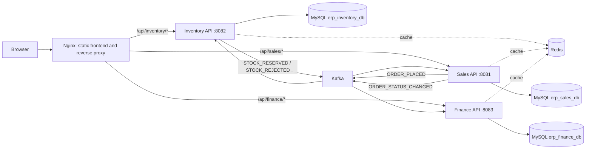

# Star Enterprises ERP

Star Enterprises ERP is a role-based business dashboard for inventory, sales, customer orders, invoicing, and payment tracking. A React application calls three Spring Boot services. MySQL stores business records, Redis caches selected reads, and Kafka carries asynchronous business events.

## Architecture



Nginx serves the production frontend and routes API paths to the backend containers. It is the reverse proxy in this deployment; there is no separate Spring API Gateway service. Each backend also validates JWTs and enforces authorization itself. Compose publishes backend ports for local access, so Nginx is not the only route to those APIs.

The services own separate logical MySQL databases, but those databases run on the same MySQL server/container in the local Compose setup. Likewise, the Compose Kafka configuration has one broker. These are development deployment boundaries, not high-availability clusters.

## Services and responsibilities

| Service | Responsibilities | Database |
| --- | --- | --- |
| Inventory | Product catalogue, stock quantities and movements, authentication, user provisioning, refresh tokens, and order stock reservations | `erp_inventory_db` |
| Sales | Customers, orders, order items, order status/history, and publishing order events | `erp_sales_db` |
| Finance | Invoices, invoice PDFs, payment status, revenue ledger, and reacting to order events | `erp_finance_db` |

Sales reads the orderable product catalogue from Inventory over REST so the dashboard can offer products. Stock reservation itself is not a synchronous REST call: Sales publishes an order event and Inventory processes it asynchronously through Kafka.

## Order workflow: outbox, Kafka, and JSON

An order starts in `PENDING`. The API returns that state before inventory reservation completes; the dashboard should treat the status as pending until a later read shows the result.

```mermaid
sequenceDiagram
    participant UI as Dashboard
    participant S as Sales service
    participant SDB as Sales MySQL
    participant K as Kafka
    participant I as Inventory service
    participant IDB as Inventory MySQL
    participant F as Finance service

    UI->>S: POST order
    S->>SDB: Save PENDING order, items, history and ORDER_PLACED outbox row
    S-->>UI: Return PENDING order
    S->>K: Outbox publisher sends ORDER_PLACED JSON
    K->>I: Deliver order event
    I->>IDB: Validate items and stock; reserve quantities if available
    I->>IDB: Save processed-event ID and result outbox row
    I->>K: Outbox publisher sends STOCK_RESERVED or STOCK_REJECTED JSON
    K->>S: Deliver reservation result
    S->>SDB: Set CONFIRMED or REJECTED; save history and processed-event ID
    S->>SDB: Save ORDER_STATUS_CHANGED outbox row
    S->>K: Publish order status event
    K->>F: Finance consumes status and reservation events
```

1. Sales saves the order, order items, initial status history, and an `ORDER_PLACED` outbox record in its database transaction.
2. A scheduled publisher polls pending outbox records (up to 50 per pass, about once per second) and sends them to Kafka. The order number is the Kafka key, keeping events for the same order on the same partition.
3. Inventory validates event fields, ignores already-processed event IDs, groups quantities by SKU, and checks the full requested set before decrementing stock. It records stock movements for successful reservations.
4. Inventory saves either a `STOCK_RESERVED` or `STOCK_REJECTED` outbox event and the incoming processed-event ID in the same database transaction as its reservation decision.
5. Sales consumes the result, maps it to `CONFIRMED` or `REJECTED`, adds status history, records the event ID, and writes `ORDER_STATUS_CHANGED` to its outbox.
6. Finance consumes `STOCK_RESERVED` to create an invoice and consumes order-status events to synchronize payment state.

The outbox is a database table of events waiting to be delivered. It closes the gap where the business transaction commits but the service stops before it can send the corresponding Kafka event. The publisher retries pending rows and marks successful sends as published. Since a process can stop after Kafka accepts a message but before MySQL records it as published, duplicate delivery is possible. Consumers use `processed_events` tables and event IDs to make repeated delivery safe in the normal processing path. This is at-least-once delivery, not end-to-end exactly-once processing.

The event payloads are JSON. Sales stores JSON text in its outbox and sends it as a JSON object; Inventory serializes result events as JSON text. Consumers parse the message into an event DTO or JSON tree and validate fields such as `eventId`, `eventType`, and `occurredAt`.

Kafka topics are configured with three partitions and replication factor one. Main topics retain records for seven days; configured dead-letter topics (`<topic>.DLT`) retain records for fourteen days. Consumers use disabled auto-commit, record-level acknowledgment, bounded retries, and dead-letter publishing. Dead-letter records need operational monitoring and a remediation/replay process. These settings suit a local single-broker stack; replication factor one provides no broker redundancy.

### Event names

| Event | Producer | Consumer(s) | Effect |
| --- | --- | --- | --- |
| `ORDER_PLACED` | Sales | Inventory | Check/reserve stock or reject the order |
| `STOCK_RESERVED` | Inventory | Sales, Finance | Confirm order; create invoice |
| `STOCK_REJECTED` | Inventory | Sales | Reject order and retain the reason |
| `ORDER_STATUS_CHANGED` | Sales | Finance | Synchronize invoice/payment state |
| `STOCK_LOW` | Inventory | Topic configured; no business consumer currently shown | Records a low-stock notification event |

## Authentication and role-based access control

Inventory owns the user records and login endpoints. Login accepts a username and password, checks the stored BCrypt password hash, then returns a signed JWT access token and a persisted refresh token. Access tokens default to 15 minutes and refresh tokens to seven days. Refresh rotates the token; logout revokes the submitted refresh token. User provisioning requires the separate `X-Provisioning-Key` header.

All three services require the same `APPLICATION_SECURITY_JWT_SECRET_KEY` so they can validate each other’s access tokens. Use at least 32 bytes of cryptographically random secret material. The frontend attaches the access token as `Authorization: Bearer <token>` and attempts refresh after a `401` response. The current browser client stores tokens in `localStorage`.

Supported roles and backend access rules:

| Role | Access |
| --- | --- |
| `ROLE_INVENTORY_USER` | Inventory product and stock-management API |
| `ROLE_SALES_USER` | Sales customer/order API; read-only orderable inventory catalogue |
| `ROLE_FINANCE_USER` | Finance invoice and payment API |

Frontend role-based module selection improves the UI experience; backend service security rules are the actual API access control. Existing legacy roles are migrated by Inventory startup code: `ROLE_ADMIN` and `ROLE_WAREHOUSE_MANAGER` become `ROLE_INVENTORY_USER`; `ROLE_VIEWER` is disabled and mapped to the supported inventory enum value.

JWTs are signed, not encrypted. Treat the shared signing secret as sensitive: any service holding it can verify tokens, and compromise of that secret undermines token trust across the services. Access JWTs are short-lived but are not immediately revoked when a refresh token is revoked. Since browser tokens are stored in `localStorage`, protect the frontend against cross-site scripting.

## MySQL and Redis

### MySQL: persistent source of truth

Each service uses its own logical database and owns its writes. Spring Data JPA maps entities to tables, repositories provide persistence operations, and service-layer transactions group business updates. The Compose MySQL initialization creates `erp_inventory_db`, then `Docker/mysql-init/01-create-service-databases.sh` creates the Sales and Finance databases and grants the configured application account access.

The initialization script runs when the MySQL data directory is first initialized. If an existing `mysql_data` volume does not contain the Sales and Finance databases, initialize those databases/grants manually or use a fresh development volume. `docker compose down -v` removes persisted local MySQL, Redis, and Kafka data.

### Redis: cache, not the database

Redis is used through Spring’s cache abstraction with JSON serialization, a ten-minute default TTL, and cache eviction after selected writes. MySQL remains authoritative; Redis is not a complete replica of service records.

| Service | Example cache names/data |
| --- | --- |
| Inventory | Product list, product by ID, product by SKU |
| Sales | Order list, customer list |
| Finance | Invoice list, finance dashboard aggregates |

Each service uses distinct cache names in the shared Redis server. Cache failures are logged and configured to fall back to database behavior. The browser also has a localStorage product-read fallback; that is separate from Redis and can be stale until refreshed.

## Docker Compose and networking

`Docker/docker-compose.yml` defines MySQL, Redis, Kafka, all three API services, and the frontend. Containers communicate over the `erp-network` bridge using service DNS names such as `mysql`, `redis`, and `kafka`. Named volumes persist database, cache, and broker data. Health checks gate backend startup on MySQL, Redis, and Kafka health; the frontend depends on the API containers.

Containers package and isolate processes, but do not make the services independent of shared infrastructure. A MySQL outage affects all business services; Kafka downtime pauses event progress; Redis downtime increases database reads. The local Compose broker is a single node with replication factor one, so this setup is not a highly available production deployment.

## Quick start with Docker Compose

Copy `Docker/.env.example` to `Docker/.env` and replace every placeholder with unique, strong local secrets. The example values are placeholders and must not be used as production credentials.

From the repository root:

```bash
docker compose --env-file Docker/.env -f Docker/docker-compose.yml up --build
```

Open [http://localhost](http://localhost) when the stack is ready. Stop containers and keep persisted data with:

```bash
docker compose --env-file Docker/.env -f Docker/docker-compose.yml down
```

Remove containers and persisted MySQL, Redis, and Kafka volumes with:

```bash
docker compose --env-file Docker/.env -f Docker/docker-compose.yml down -v
```

### Provisioning users

No demo users or public self-registration are created by current source code. Set `USER_PROVISIONING_KEY` in `Docker/.env`, then provision accounts through Inventory. For example, with curl:

```bash
curl -X POST http://localhost:18082/api/auth/provision \
  -H "Content-Type: application/json" \
  -H "X-Provisioning-Key: <USER_PROVISIONING_KEY>" \
  -d '{"username":"inventory","password":"<choose-a-password>","role":"ROLE_INVENTORY_USER"}'
```

Repeat with `ROLE_SALES_USER` and `ROLE_FINANCE_USER` for those users. Choose unique passwords and keep the provisioning key private.

## Local development

### Frontend

```bash
cd Frontend/frontend-dashboard
npm install
copy .env.example .env
npm run dev
```

Vite serves the dashboard at `http://localhost:5173` and proxies API paths to the published backend ports. The frontend `.env.example` contains API base URL templates; in Docker, the Compose build arguments use `/api/inventory`, `/api/sales`, and `/api/finance` so requests go through Nginx.

### Backend services

Run each application from its Maven project directory. All require `APPLICATION_SECURITY_JWT_SECRET_KEY`; Inventory also requires `USER_PROVISIONING_KEY` to enable controlled provisioning. Run MySQL, Redis, and Kafka locally or provide equivalent services at the configured addresses.

```bash
cd Microservices/inventory-service/inventory-service
mvn spring-boot:run
```

```bash
cd Microservices/sales-service
mvn spring-boot:run
```

```bash
cd Microservices/finance-service
mvn spring-boot:run
```

For PowerShell, generate a shared random signing secret and set it in the shell used to launch the services:

```powershell
$env:APPLICATION_SECURITY_JWT_SECRET_KEY = [Convert]::ToBase64String([Security.Cryptography.RandomNumberGenerator]::GetBytes(32))
```

Keep the generated value securely and configure the exact same value for all three services. Do not commit secrets or add development fallback JWT keys to application files.

## Port map

| Component | Host port | Purpose |
| --- | ---: | --- |
| Frontend/Nginx | 80 | Production UI and reverse proxy |
| Vite dev server | 5173 | Local frontend development |
| Inventory API | 18082 | Authentication, products, stock |
| Sales API | 18081 | Customers and orders |
| Finance API | 18083 | Invoices and payments |
| MySQL | 3307 | Persistent relational data |
| Redis | 6379 | Application caches |
| Kafka | 9092 | Host-accessible event broker |

Inside Compose, services use container ports and DNS names (for example, `mysql:3306` and `kafka:29092`), not the host-published ports.

## Project structure

```text
.
├── Docker/
│   ├── docker-compose.yml
│   ├── .env.example
│   └── mysql-init/                 # Initial databases and grants
├── Frontend/
│   └── frontend-dashboard/
│       ├── src/
│       │   ├── api/                # Shared Axios client and token handling
│       │   └── modules/
│       │       ├── auth/           # Login, session context, role selection
│       │       ├── inventory/      # Product and stock UI/API client
│       │       ├── sales/          # Customers, orders, order UI/API client
│       │       └── finance/        # Invoice and payment UI/API client
│       ├── public/                 # Static assets
│       ├── Dockerfile              # Vite build, then Nginx runtime
│       ├── nginx.conf              # Static hosting and API proxy routes
│       ├── vite.config.js          # Local development API proxies
│       └── package.json            # Frontend dependencies and scripts
└── Microservices/
    ├── inventory-service/inventory-service/
    ├── sales-service/
    └── finance-service/
        # Each service has pom.xml, Dockerfile, src/main, src/test,
        # application.properties, and Maven wrapper scripts.
```

Backend source packages generally follow these responsibilities: `Controller/` maps HTTP routes; `Service/` holds business logic and transactions; `Repository/` defines database access; `Entity/` maps persistent records; `Dto/` defines API/event contracts; `Config/` configures security, Kafka, Redis, and application behavior; `Kafka/` contains event consumers, outbox pollers, and publishers; `Exception/` contains domain and HTTP error handling; `Security/` contains JWT filters and helpers where separated. `src/test/` contains service and RBAC tests.

Notable service-specific models include Inventory users, roles, refresh tokens, products, stock movements, processed events, and outbox events; Sales customers, orders, items, status history, processed events, and outbox events; and Finance invoices, invoice items, payment status, revenue ledger entries, and processed events.

## Configuration files

| File | Purpose |
| --- | --- |
| `Docker/docker-compose.yml` | Local containers, environment variables, ports, volumes, network, health checks |
| `Docker/.env.example` | Template for database, JWT, and provisioning secrets |
| `Docker/mysql-init/01-create-service-databases.sh` | Creates Sales/Finance databases and grants on fresh MySQL initialization |
| `Microservices/*/src/main/resources/application.properties` | Service port and database, Redis, Kafka, JWT, and topic settings |
| `Microservices/*/pom.xml` | Java/Spring dependencies and Maven build configuration |
| `Microservices/*/Dockerfile` | Backend container build and runtime setup |
| `Frontend/frontend-dashboard/package.json` | NPM dependencies and build/lint scripts |
| `Frontend/frontend-dashboard/vite.config.js` | Development server and local API proxy rewrites |
| `Frontend/frontend-dashboard/nginx.conf` | Production static hosting and API reverse-proxy mapping |
| `Frontend/frontend-dashboard/Dockerfile` | Multi-stage frontend build and Nginx runtime image |

The Finance service uses environment variable names such as `DB_URL` and `KAFKA_BOOTSTRAP_SERVERS`; Inventory and Sales use Spring-style names such as `SPRING_DATASOURCE_URL` and `SPRING_KAFKA_BOOTSTRAP_SERVERS`. Follow the corresponding Compose service or `application.properties` when configuring a local run.

## Reliability and operational limits

- **Eventual consistency:** an accepted order remains pending until Inventory’s result event is processed by Sales.
- **At-least-once events:** outbox publishing can duplicate an event if the process stops after Kafka accepts it but before the database marks it published. Consumers use event IDs for deduplication.
- **Publisher scaling:** outbox polling selects pending batches; the current code does not show a database row-claim/locking strategy for multiple publisher instances. Scaling service replicas can therefore cause duplicate sends.
- **Stock concurrency:** product records use a version field for optimistic locking. Concurrent reservations can conflict; callers and operations need a clear retry/failure path.
- **Cancellation:** the current cancellation endpoint applies to pending orders. A post-reservation cancellation/restock compensation flow is not shown.
- **Pricing:** Sales stores prices sent in the create-order request. Validate against an authoritative price source if clients must not choose prices.
- **Dead letters:** repeated listener failures can be sent to DLT topics. DLTs need monitoring and a replay or remediation procedure.
- **Shared infrastructure:** one MySQL server, one Redis instance, and one Kafka broker are single points of failure in this local stack.

## License

This project is currently provided for internal use. Add the organization’s approved license text before distributing it publicly.
